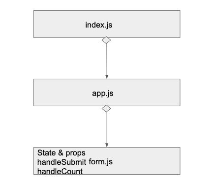

 LAB
=================================================

## Internal State Practice

### Author: Melissa

### Links and Resources
* [submission PR](https://github.com/401-advancedjs/internal-state-practice/pull/2)
* [travis](https://www.travis-ci.com/401-advancedjs/internal-state-practice)

### Modules
#### `app.js`
#### `form.js`

#### Running the app
* `npm run start`
  
#### Tests
* How do you run tests? `npm run test`
* What assertions were made?

  * Counter increments everytime a submit is clicked
  * Name is being changed in the state
  * basic rendering onto page
  * Format follows snapshot
* What assertions need to be / should be made?
  * Nothing at the moment

#### UML

